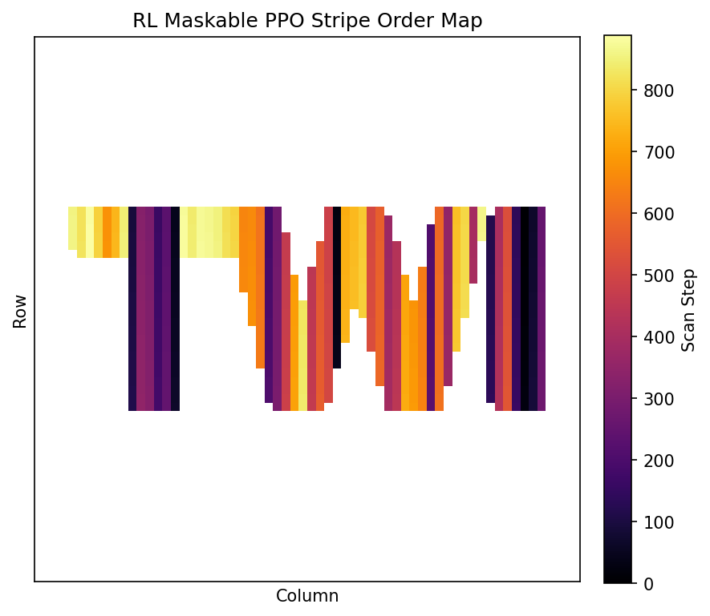
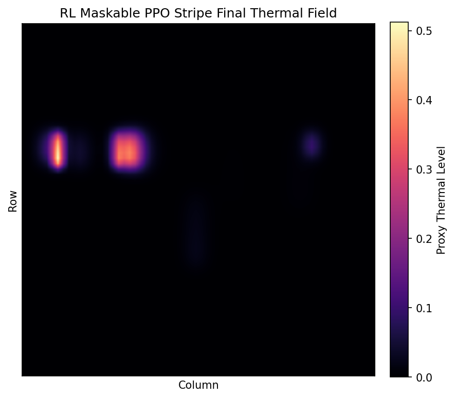
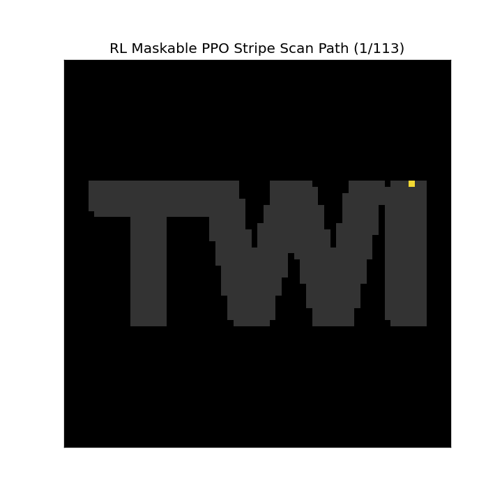
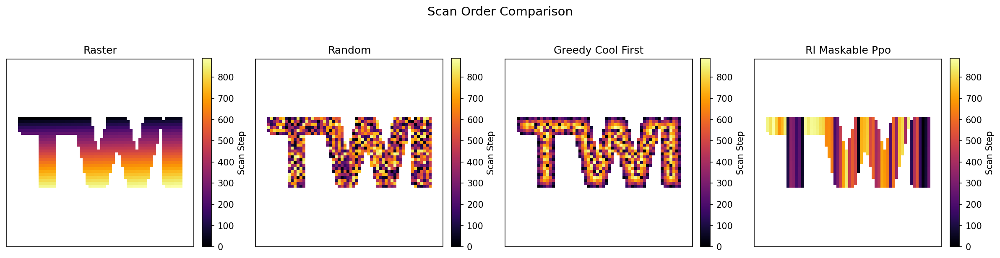
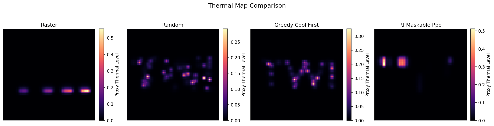
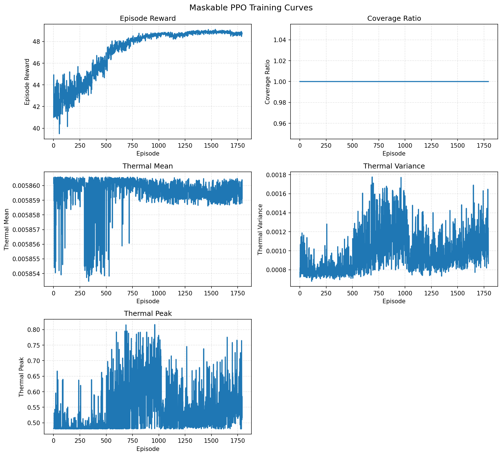

# RL-LAM-ScanOpt

**RL-LAM-ScanOpt** is a lightweight research/demo project for **reinforcement learning-based scan path optimisation inside letter-shaped regions** such as `TWI`.

Instead of treating the scan area as a full rectangular plate, this project uses the **interior of the letters themselves** as the legal scan region. The core question is simple:

> Can we learn a scan order that produces a more uniform thermal field and fewer concentrated hotspots than simple handcrafted baselines?

This repository is intentionally designed as a **fast, interpretable, engineering-friendly demo**. It does **not** attempt to be a calibrated process simulator.

## Latest Validation Round

The most recent work in this repository was a strict attempt to answer one question before investing in larger PPO runs:

> Can any patch-based action representation produce a learning-facing signal that is strong and local enough for PPO to learn a thermo-aware policy?

At this point, the answer is **no**.

The patch-action family has now been tested systematically across multiple increasingly local designs. These environments are useful as diagnostics and they preserve sensible baseline discrimination, but they still do **not** produce a PPO-friendly representation with a clear thermal advantage over random behavior.

### Final Patch-Family Verdict

- Patch-based actions are **runnable and diagnostically useful**
- Patch-based actions are **not** currently a good PPO representation
- PPO is no longer collapsing the way it did in the original stripe setup, but it is still not learning a convincing thermo-aware policy
- The main bottleneck now appears to be the **action abstraction itself**, not the PPO algorithm and not the current reward weighting
- The next action-representation branch should move toward **selector / priority-based actions**, not more patch variants

### What Was Tested

#### 1. Stripe-based action

- Mean locality: about `15.9` cells per action
- Result: PPO showed severe early clustering
- Early adjacency during smoke testing was about `0.944`
- Verdict: **too coarse, credit assignment collapse**

#### 2. Fixed segment action (`segments_per_stripe = 6`)

- Mean locality: `2.67`
- Thermal share: `0.261`
- PPO no longer collapsed
- But PPO stayed close to `random_segment6`
- Strict PPO gate result: **NO-GO**

This remains the **best patch-based baseline representation tested so far**, but it still fails as a convincing PPO candidate.

#### 3. Variable-length segment action

Action format:

- `(stripe_id, start_cell, length[2..8])`

Diagnostics:

- action count increased from `336` to `6230`
- mean affected cells increased from `2.67` to `4.25`
- thermal share changed from `0.261` to `0.258`
- distance-aware early adjacency worsened from `0.010` to `0.184`

Verdict:

- **NO-GO**
- bigger catalog
- less stable structure
- no stronger thermal learning signal

#### 4. Local-window action

Action format:

- local centered `3-cell` window
- horizontal / vertical orientation

Diagnostics:

- action count increased to about `1780`
- mean affected cells stayed near `2.83`
- thermal share dropped from `0.261` to `0.240`
- distance-aware early adjacency worsened from `0.010` to `0.027`

Verdict:

- **NO-GO**
- more actions, weaker thermal signal, no clear PPO-facing gain

#### 5. Local primitive action

Action format:

- strict `2-cell` primitive
- anchor + local direction

Diagnostics:

- action count about `1769`
- mean affected cells dropped to `1.92`
- thermal share dropped from `0.261` to `0.227`
- distance-aware early adjacency worsened from `0.010` to `0.124`

Verdict:

- **NO-GO**
- locality improved
- but thermal signal weakened too much

#### 6. Directional primitive action

Action format:

- strict `2-cell` primitive
- `(anchor_row, anchor_col, direction)`
- `direction ∈ {right, down}`

Diagnostics:

- action count: `1780`
- mean affected cells: `1.91`
- max affected cells: `2`
- thermal share: `0.227`
- distance-aware early adjacency: `0.124`

Comparison:

- more local than fixed `segment=6`
- not thermally stronger than fixed `segment=6`
- only trivially different from the earlier `local primitive`

Verdict:

- **NO-GO**
- this was the final controlled patch-based validation
- patch-based action design should now be **deprioritized**

### Key Numeric Takeaways

| Representation | Action Count | Mean Cells/Action | Thermal Share | Distance-aware Early Adjacency | Verdict |
| --- | ---: | ---: | ---: | ---: | --- |
| stripe | n/a | 15.89 | 0.253 | n/a | NO-GO |
| segment=6 | 336 | 2.67 | 0.261 | 0.010 | best patch baseline, still NO-GO for PPO scaling |
| variable-length | 6230 | 4.25 | 0.258 | 0.184 | NO-GO |
| local-window | 1780 | 2.83 | 0.240 | 0.027 | NO-GO |
| local-primitive | 1769 | 1.92 | 0.227 | 0.124 | NO-GO |
| directional-primitive | 1780 | 1.91 | 0.227 | 0.124 | NO-GO |

### Strict PPO Smoke Test Result (`segment=6`)

This is still the only patch-based setup that was strong enough to justify a controlled PPO smoke test.

| Policy | Total Reward | Coverage | Invalid Rate | Reheat | Peak | Early Adjacency |
| --- | ---: | ---: | ---: | ---: | ---: | ---: |
| `ppo_segment6` | 172.617 | 1.000 | 0.000% | -8.611 | -122.641 | 0.061 |
| `random_segment6` | 171.503 | 1.000 | 0.000% | -9.583 | -122.567 | 0.061 |
| `distance_aware_cool_first_segment6` | 200.047 | 1.000 | 0.000% | -8.894 | -119.771 | 0.010 |

Strict gate result:

- `coverage = 1.0`: **pass**
- `invalid < 1%`: **pass**
- `early adjacency < 0.5`: **pass**
- `total reward >= random + 15%`: **fail**
- `reheat >= 20% better than random`: **fail**
- `peak >= 20% better than random`: **fail**

This matters because it shows the current state very clearly:

- PPO is **not** totally broken anymore
- PPO is **still too close to random**
- PPO is **not yet showing a robust thermo-aware advantage**

### Explicit Failure Summary

These failures should be read as real project findings, not temporary inconveniences:

1. **Patch-based action does not currently give PPO a strong enough thermal learning signal**
   - locality can be improved
   - but thermal-share dominance gets weaker, not stronger
2. **The best structured heuristic remains far ahead of PPO**
   - `distance_aware_cool_first` stays clearly better than PPO in the validated patch setup
3. **Making actions smaller is not enough**
   - the most local patch primitives improved locality
   - but did not improve PPO-facing thermal attribution
4. **Some “improvements” are actually misleading**
   - lower affected cells per action does **not** automatically mean better learning
   - once thermal share drops and early structure worsens, PPO does not benefit
5. **The action family itself is now the main suspect**
   - not the reward weights
   - not the current proxy thermal update
   - not the observation channels

### Current Gate Decision

- Current best patch-based representation: **fixed `segment=6`**
- Final patch-family verdict: **NO-GO**
- Recommended next step: **move to selector / priority-based action representation**

### Useful Output Files

Patch-family diagnostics referenced above are saved locally in:

- `assets/models/segment_count_sweep_verdict.txt`
- `assets/models/action_granularity_sweep_comparison.csv`
- `assets/models/ppo_smoke_segment6_verdict.txt`
- `assets/models/ppo_vs_baselines_segment6.csv`
- `assets/models/action_space_comparison_variable_segment.csv`
- `assets/models/variable_segment_diagnostics_summary.txt`
- `assets/models/local_window_action_verdict.txt`
- `assets/models/local_primitive_action_verdict.txt`
- `assets/models/directional_primitive_action_verdict.txt`
- `assets/models/directional_primitive_vs_segment6_comparison.csv`
- `assets/models/directional_primitive_vs_local_primitive_comparison.csv`

Recent figures include:

- `assets/figures/maskable_ppo_smoke_segment6_training_curve.png`
- `assets/figures/ppo_smoke_segment6_reward_breakdown.png`
- `assets/figures/ppo_smoke_segment6_heatmap_comparison.png`
- `assets/figures/ppo_smoke_segment6_scan_order_comparison.png`
- `assets/figures/baseline_reward_breakdown_variable_segment.png`
- `assets/figures/baseline_heatmap_comparison_variable_segment.png`
- `assets/figures/baseline_scan_order_comparison_variable_segment.png`
- `assets/figures/baseline_reward_breakdown_local_window.png`
- `assets/figures/baseline_reward_breakdown_local_primitive.png`
- `assets/figures/baseline_reward_breakdown_directional_primitive.png`

## Why This Project Exists

In laser-based additive manufacturing, scan order matters. Even with a simplified thermal proxy, the order in which the beam visits different parts of a geometry can change:

- how heat accumulates
- how evenly temperature is distributed
- how strongly hotspots cluster
- how large stress-related proxy risk may become

RL-LAM-ScanOpt turns that intuition into a compact optimisation problem that is easy to visualise, easy to extend, and fast enough to iterate on.

## What Is Implemented Today

The current repository already supports an end-to-end demo pipeline:

- high-resolution text mask generation for targets such as `TWI`
- downsampling to a coarse `64x64` decision grid
- lightweight Gaussian heat-source plus diffusion/cooling proxy simulation
- baseline planners:
  - raster
  - random
  - greedy cool-first
- a **stripe-based** masked RL environment
- a **fixed segment-based** masked RL environment
- a **variable-length segment** diagnostic environment
- a **local-window** diagnostic environment
- a **local primitive** diagnostic environment
- a **directional primitive** diagnostic environment
- `MaskablePPO` training and evaluation
- reward-breakdown diagnostics and planner-level CSV outputs
- exported figures:
  - target masks
  - scan order maps
  - thermal maps
  - training curves
  - scan GIFs
  - comparison figures

In the current RL setup, the agent chooses the **next legal vertical stripe segment inside the letter region**, not an arbitrary out-of-mask cell.

## Current Status

The repository is now beyond the scaffold stage and already supports real experimentation:

- Phase 1 baseline simulation is implemented and runnable
- the geometry pipeline supports text masks and legal stripe segmentation
- the thermal proxy pipeline is active
- the stripe-based RL environment is implemented
- the fixed `segment=6` action environment is implemented and validated
- a variable-length action environment has been added for diagnostics
- local-window, local-primitive, and directional-primitive environments have been added for final patch-family validation
- `MaskablePPO` training is implemented with CLI control
- evaluation and visualisation scripts exist and export figures/GIFs
- a `100000`-timestep stripe-based training run has already been completed locally

Latest local training artifacts:

- model: `assets/models/maskable_ppo_twi_stripe.zip`
- history: `assets/models/maskable_ppo_twi_stripe_history.json`
- curves: `assets/figures/maskable_ppo_twi_stripe_training_curves.png`

At the moment, the repository is strongest as a **working experimental demo platform**, not yet as a polished benchmark suite.

## Latest Stripe Evaluation

The latest official local evaluation was run using the stripe-based checkpoint:

- model: `assets/models/maskable_ppo_twi_stripe.zip`
- summary: `training_results_stripe.md`

Current comparison snapshot:

| Planner | Coverage | Thermal Mean | Thermal Peak | Thermal Variance | Steps |
| --- | ---: | ---: | ---: | ---: | ---: |
| raster | 1.000 | 0.006 | 0.555 | 0.001 | 890 |
| random | 1.000 | 0.006 | 0.292 | 0.000 | 890 |
| greedy_cool_first | 1.000 | 0.006 | 0.326 | 0.000 | 890 |
| rl_maskable_ppo_stripe | 1.000 | 0.006 | 0.512 | 0.001 | 890 |

Takeaway:

- the stripe-based RL model reaches full coverage
- it clearly improves over `raster`
- it is still behind `random` and `greedy_cool_first` on this simplified proxy task
- the project is now in the phase where reward tuning and evaluation quality matter more than scaffolding

### Latest Visuals

#### RL Stripe Order Map



#### RL Stripe Thermal Map



#### RL Stripe Scan GIF



#### RL vs Baselines







## Project Scope

Included:

- letter-shaped scan regions such as `TWI`
- stripe-based or cell-wise scan-order reasoning on a coarse grid
- lightweight thermal proxy updates
- RL and baseline comparison
- visualisation-first experimentation

Explicitly out of scope:

- FEM
- exact melt-pool simulation
- exact residual stress prediction
- calibrated temperature prediction
- production-ready process planning

## Core Idea

The repository separates the problem into a few small, understandable parts:

1. **Geometry**
   Generate a text mask and turn it into a legal scan region.

2. **Thermal Proxy**
   Apply a Gaussian-like heat deposit, then diffuse and cool the field after each scan step.

3. **Planner / Policy**
   Choose the next scan action, either from a baseline heuristic or from an RL policy.

4. **Metrics**
   Compare final thermal variance, peak temperature, mean temperature, coverage, and visual scan structure.

5. **Visual Outputs**
   Turn the result into order maps, thermal maps, GIFs, and comparison charts that are easy to explain.

## Current RL Formulation

### Observation

The policy observes a channel-first tensor:

- `target_mask`
- `scanned_mask`
- `thermal_field`

This is designed to be CNN-friendly.

### Action Space

This repository now contains **multiple action-representation families** that were tested in controlled diagnostics:

- stripe-based actions
- fixed segment actions
- variable-length segment actions
- local-window actions
- local-primitive actions
- directional-primitive actions

The important current conclusion is:

- the project can support all of these action spaces
- but none of the tested **patch-based** families have yet produced a PPO-ready thermo-aware learning signal
- the most promising next branch is **selector / priority-based action design**, not another patch variant

### Reward

The reward is a simple thermal-quality proxy, built to encourage useful behaviour without pretending to be a physical truth model.

It includes:

- coverage progress
- penalty for high thermal variance
- penalty for high peak temperature
- local temperature-difference shaping
- hotspot-dispersion shaping
- invalid-action penalty

## Repository Structure

```text
app/
assets/
  figures/
  models/
core/
  evaluators/
  planners/
rl/
scripts/
tests/
```

### Important Files

| Path | Purpose |
| --- | --- |
| `core/geometry.py` | Text masks, coarse grids, stripe generation |
| `core/thermal.py` | Gaussian heat input and diffusion/cooling proxy |
| `core/rollout.py` | Executes scan sequences and records outputs |
| `core/viz.py` | Figures, comparison plots, GIF generation |
| `core/planners/` | Raster, random, and greedy baselines |
| `rl/env_scan.py` | Masked Gymnasium environment for stripe-based scan planning |
| `rl/train_maskable_ppo.py` | Train `MaskablePPO` on the stripe environment |
| `rl/eval_policy.py` | Evaluate RL against baselines and export visuals |
| `scripts/run_baselines.py` | Run the baseline planners |
| `scripts/search_top_sequences.py` | Large-scale candidate search for strong scan orders |

## How To Run

### 1. Install dependencies

```powershell
python -m venv .venv
.venv\Scripts\Activate.ps1
pip install -r requirements.txt
```

If you already have a CUDA-ready Python environment, you can use that instead.

### 2. Generate baseline results

```powershell
python scripts\run_baselines.py
```

### 3. Train the stripe-based RL policy

```powershell
python rl\train_maskable_ppo.py --timesteps 100000
```

Useful CLI options:

- `--timesteps`
- `--device`
- `--save-path`
- `--log-interval`

Example:

```powershell
python rl\train_maskable_ppo.py --timesteps 100000 --device cuda --save-path assets/models/maskable_ppo_twi_stripe.zip
```

### 4. Evaluate the trained model

```powershell
python rl\eval_policy.py
```

## Generated Outputs

The project can generate:

- target mask images
- scan-order heatmaps
- final thermal maps
- RL scan-path GIFs
- baseline vs RL comparison figures
- training curves
- markdown summary reports

Typical output locations:

- `assets/figures/`
- `assets/models/`
- `training_results.md`
- `training_results_stripe.md`
- `WORK_SUMMARY.md`

## Recent Progress In This Repository

This repository has recently evolved from a simple masked scan demo into a broader **action-representation diagnostic platform**:

- the geometry module supports legal scan decomposition inside letter masks
- multiple patch-based action families have been implemented and compared
- training is driven by `MaskablePPO` when a representation passes diagnostic gates
- evaluation exports order maps, thermal maps, comparison grids, and GIF animations
- the training script supports CLI control for practical experimentation

That means the repo is no longer just a concept scaffold; it is now a runnable experimental platform for deciding which action abstractions are actually learnable.

## Practical Notes

- Training is launched through `rl/train_maskable_ppo.py`
- the training script now supports CLI control for faster iteration
- the evaluation script still compares RL against raster, random, and greedy baselines
- the search script can also perform large-scale candidate-sequence search outside the RL loop

If you want to continue from the current state, the most useful next command is:

```powershell
python rl\train_maskable_ppo.py --timesteps 100000
```

## How To Judge Whether A Run Is Useful

The most practical evaluation questions are:

1. Does the RL scan order look more like a deliberate process strategy than a noisy jump pattern?
2. Is the final thermal map more uniform than raster?
3. Are thermal variance and peak temperature improving relative to at least one baseline?
4. Are the figures and GIFs clear enough to explain the result to a non-ML audience?

For this project, **explainability and comparison quality** are as important as raw optimisation performance.

## Limitations

Please read this repository as a **planning demo**, not as a validated manufacturing model.

- The thermal field is a proxy field.
- Stress-related outputs are qualitative or relative proxies.
- Results should be interpreted comparatively, not as absolute process guarantees.
- A policy that looks good here still requires more serious physics before any real manufacturing claim.

## Disclaimer

This repository uses simplified proxy models for thermal behaviour and stress-related risk.

- It does **not** predict exact physical temperature.
- It does **not** predict exact residual stress.
- It does **not** replace calibrated process simulation.

Its value is in showing how scan-sequence optimisation can be framed, trained, visualised, and compared in a compact, modular system.

## Next Logical Extensions

If we continue this work, the highest-value next steps are:

1. Move from patch-based actions to a **selector / priority-based action representation**.
2. Keep the current reward and proxy thermal model fixed while validating that new action branch cleanly.
3. Add multiple geometries instead of training only on one fixed `TWI` mask.
4. Add cleaner experiment/version tracking for multiple RL runs and result sets.

---

If you are reading this repo on GitHub, the shortest summary is:

**RL-LAM-ScanOpt is a modular demo for learning better scan orders inside letter-shaped additive manufacturing regions using a lightweight thermal proxy and strong visual outputs.**
