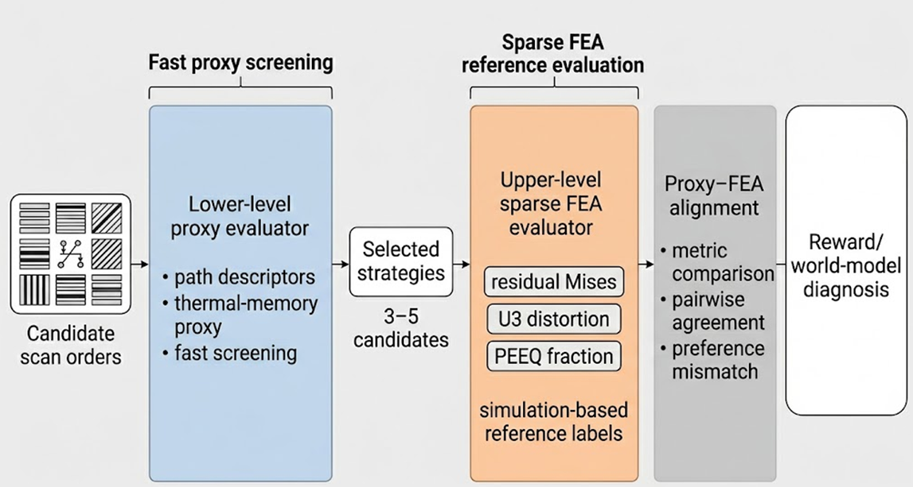
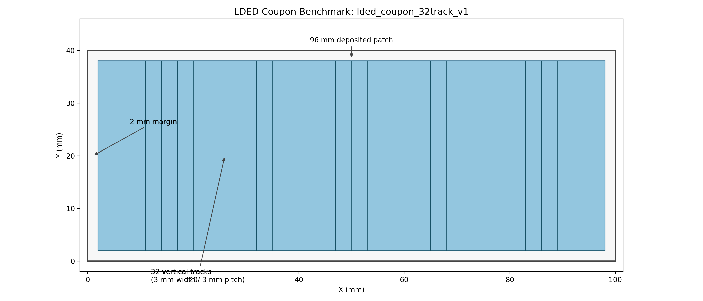

# RL-LAM-ScanOpt

[](#)
[](#)
[](#)

`RL-LAM-ScanOpt` is now a **line-order benchmark + FEA-teacher preparation repository** for laser directed energy deposition (LDED).

The active branch is no longer "train PPO on a cheap thermal proxy."  
The active branch is:

1. define a compact **LDED 32-track benchmark**
2. generate a **diverse candidate trajectory pool**
3. export trajectories into **Abaqus/FEA-consumable scan paths**
4. curate a **small, high-value teacher set** for sparse FEA evaluation and paper-ready analysis



## Status Snapshot

| Item | Current State |
| --- | --- |
| Active benchmark | `lded_coupon_32track_v1` |
| Geometry | `100 x 40 mm` plane, `96 x 36 mm` deposited patch, `32` vertical tracks |
| Teacher pool | `46` line-order trajectories |
| FEA exports | `46 / 46` trajectories exported to `scan_path.csv + metadata.json` |
| Abaqus sanity package | `4` representative trajectories prepared |
| Teacher ODB inventory | `20` ODBs scanned, `10` valid teacher-label candidates |
| Current strategy expansion | baseline, proxy-best, proxy-worst, ambiguous, perturbed, and new windowed-dispersion family |

## Why The Direction Changed

The original proxy-only RL line has already been stress-tested and **deprioritized**.

Confirmed `NO-GO` branches:

- PPO on the cheap proxy
- patch-based action families
- reward-only rewrites
- selector-state coupling
- offline partial-state ranking under the same cheap proxy semantics

The working conclusion is:

> the cheap evaluator is not sufficiently sensitive to scan-order history and cumulative path effects to be the main learning target.

That is why the repository has shifted from **proxy-RL optimization** to **teacher generation, export, and validation**.

Legacy RL / TWI / grid assets are still preserved for traceability, but they are not the active front door anymore.

## Repository Workspace

The canonical Git workspace for current development is:

`E:\Projects\RL-LAM-ScanOpt`

Stage 1 and Stage 2 large historical simulation data may remain in local D-drive archives. GitHub stores the reproducibility-critical code, documentation, manifests, and bounded evidence packages rather than the complete Abaqus runtime workspace.

See:

`docs/repository/LOCAL_ARCHIVE_AND_WORKSPACE_POLICY.md`

## Active Benchmark: `lded_coupon_32track_v1`

This benchmark models a simple single-layer LDED coupon as a **track-order permutation** problem.

| Field | Value |
| --- | --- |
| Working plane | `100 mm x 40 mm` |
| Deposited patch | `96 mm x 36 mm` |
| Margin | `2 mm` on all sides |
| Track count | `32` |
| Track width | `3 mm` |
| Track pitch | `3 mm` |
| Track length | `36 mm` |
| Fixed direction | `bottom_to_top` |
| Trajectory type | length-`32` permutation of track ids `0..31` |

Primary files:

- [core/geometry.py](core/geometry.py)
- [scripts/preview_lded_coupon_32track.py](scripts/preview_lded_coupon_32track.py)
- [docs/lded_fea_teacher_pipeline.md](docs/lded_fea_teacher_pipeline.md)



Preview outputs:

- `assets/figures/lded_coupon_32track_layout.png`
- `assets/figures/lded_coupon_32track_layout_with_ids.png`
- `assets/figures/lded_coupon_32track_baseline_previews.png`
- `assets/data/lded_coupon_32track_baselines.json`

## Current Mainline Pipeline

### 1. Baseline and candidate trajectory generation

The repository now supports deterministic line-order strategies such as:

- `raster_left_to_right`
- `raster_right_to_left`
- `center_out`
- `edge_in`
- `odd_even_interlaced`
- `even_odd_interlaced`
- random seeds
- proxy-best / proxy-worst / ambiguous / perturbed variants

### 2. FEA-teacher pool construction

Pool builder:

- [scripts/build_fea_teacher_pool.py](scripts/build_fea_teacher_pool.py)

Output:

- `assets/fea_teacher_pool_lded_32track/`

Current pool summary:

- selected trajectories: `46`
- source distribution:
  - `anchor_baseline = 7`
  - `proxy_best = 10`
  - `proxy_worst = 5`
  - `random_diverse = 8`
  - `proxy_ambiguous = 8`
  - `perturbed_or_mixed = 8`
- duplicate permutations removed: `1`
- target size `30-50`: satisfied

Key files:

- `assets/fea_teacher_pool_lded_32track/fea_teacher_pool_manifest.csv`
- `assets/fea_teacher_pool_lded_32track/fea_teacher_pool_manifest.json`
- `assets/fea_teacher_pool_lded_32track/fea_teacher_pool_summary.txt`
- `assets/fea_teacher_pool_lded_32track/sequences/*.json`

### 3. FEA scan-path export

Exporter:

- [scripts/export_lded_pool_to_fea_paths.py](scripts/export_lded_pool_to_fea_paths.py)

Output:

- `assets/fea_teacher_pool_lded_32track/fea_exports/`

Current export state:

- found trajectories: `46`
- exported trajectories: `46`
- failed exports: `0`
- track duration: `3.6 s`
- total deposition time per trajectory: `115.2 s`
- coordinate range:
  - `x = 3.5 .. 96.5 mm`
  - `y = 2.0 .. 38.0 mm`
  - `z = 0.0 mm`

Key files:

- `assets/fea_teacher_pool_lded_32track/fea_exports/fea_export_manifest.csv`
- `assets/fea_teacher_pool_lded_32track/fea_exports/fea_export_manifest.json`
- `assets/fea_teacher_pool_lded_32track/fea_exports/fea_export_summary.txt`

### 4. Abaqus sanity-check package

Preparer:

- [scripts/prepare_abaqus_sanity_check.py](scripts/prepare_abaqus_sanity_check.py)

Output:

- `assets/fea_teacher_pool_lded_32track/abaqus_sanity_check/`

Selected sanity trajectories:

- `raster_left_to_right`
- `odd_even_interlaced`
- `random_seed_249` (`best_proxy_rank_1`)
- `center_out_local_reversal` (`worst_proxy_tail`)

Key files:

- `assets/fea_teacher_pool_lded_32track/abaqus_sanity_check/sanity_manifest.csv`
- `assets/fea_teacher_pool_lded_32track/abaqus_sanity_check/sanity_manifest.json`
- `assets/fea_teacher_pool_lded_32track/abaqus_sanity_check/sanity_summary.txt`
- `assets/fea_teacher_pool_lded_32track/abaqus_sanity_check/abaqus_read_scan_path_stub.py`

## Latest Additions

### Abaqus teacher-production automation

This repository now includes a first round of **Abaqus teacher-production automation**:

- [scripts/abaqus/run_remaining_6_abaqus_jobs.py](scripts/abaqus/run_remaining_6_abaqus_jobs.py)
- [scripts/abaqus/launch_remaining_6_abaqus_jobs.ps1](scripts/abaqus/launch_remaining_6_abaqus_jobs.ps1)
- [docs/abaqus_teacher_production_run_notes.md](docs/abaqus_teacher_production_run_notes.md)

Documented night-run results:

- `formal_raster_left_to_right`: success
- `greedy_maximin_distance`: success
- `smartscan_proxy_variance`: success
- `multi_lag_regular_jump`: failed at cooling start
- `block_interleaved_quarters`: pending in the runner summary
- `center_edge_alternating`: pending in the runner summary

Small reproducibility summaries were saved at:

- `abaqus-models/night_run_remaining_6_summary/run_remaining_6_summary.csv`
- `abaqus-models/night_run_remaining_6_summary/run_remaining_6_summary.json`

### Cooling-stabilized multilag repair path

For the failed `multi_lag_regular_jump` case, the repo now includes:

- [scripts/abaqus/create_multilag_restart_cooling_v02.py](scripts/abaqus/create_multilag_restart_cooling_v02.py)
- [scripts/abaqus/create_multilag_fullrerun_cooling_stabilized_v02.py](scripts/abaqus/create_multilag_fullrerun_cooling_stabilized_v02.py)
- [scripts/abaqus/create_multilag_v03_restart_sane.py](scripts/abaqus/create_multilag_v03_restart_sane.py)

Key recorded findings:

- the original `v01` job failed at `step_final_cooling`, Step `33`, Increment `1`
- original `v01` could not be restarted because restart write had been disabled
- the `v02` path introduced cooling stabilization but created restart-write storage risk
- the `v03` restart-sane path now appears in the teacher ODB inventory as a valid candidate

### Strategy library expansion

The repo now includes a growing **scan strategy library**:

- [docs/scan_strategies/README.md](docs/scan_strategies/README.md)
- [docs/windowed_max_dispersion_strategy.md](docs/windowed_max_dispersion_strategy.md)
- [docs/scan_strategies/windowed_max_dispersion.md](docs/scan_strategies/windowed_max_dispersion.md)

Notable new strategy family:

- `windowed_max_dispersion`

This family is documented as a geometry-only short-window dispersion heuristic, with additional tied high-quality variants:

- `windowed_max_dispersion_v01`
- `windowed_max_dispersion_sa_v02`
- `windowed_max_dispersion_sa_v03`

### Teacher ODB inventory

The repo now includes a **read-only teacher ODB inventory**:

- [scripts/abaqus/inventory_teacher_odbs.py](scripts/abaqus/inventory_teacher_odbs.py)
- `abaqus-models/teacher_odb_inventory/teacher_odb_inventory.csv`
- `abaqus-models/teacher_odb_inventory/teacher_odb_inventory.json`
- `abaqus-models/teacher_odb_inventory/teacher_odb_inventory.md`

Current inventory summary:

- total ODB files found: `20`
- valid teacher-label candidates: `10`
- excluded / provisional files: `10`

The documented valid candidate set currently includes:

- `block_interleaved_quarters`
- `center_edge_alternating`
- `center_out`
- `edge_in`
- `greedy_maximin`
- `multilag_jump_v03`
- `odd_even_interlaced`
- `raster_left_to_right`
- `smartscan_proxy`
- `windowed_max_dispersion`

Important note:

- this inventory was generated by file scanning and text parsing only
- ODB files were **not opened**
- `odbAccess` was **not imported**
- Abaqus jobs were **not submitted** during inventory creation

### Paper / Overleaf asset audit

The repository also now contains a paper-facing asset audit:

- [reports/overleaf_asset_path_audit.md](reports/overleaf_asset_path_audit.md)

This audit maps existing figures and tables for later Overleaf staging, including:

- geometry figure
- stress-distortion trade-off figure
- ranking robustness heatmap
- proxy-FEA agreement figure
- field-map source assets
- teacher-label table sources

## Quick Start

### Preview the benchmark

```powershell
python scripts/preview_lded_coupon_32track.py
```

### Rebuild the LDED teacher pool

```powershell
python scripts/build_fea_teacher_pool.py --benchmark lded_coupon_32track_v1
```

### Re-export all trajectories to FEA scan paths

```powershell
python scripts/export_lded_pool_to_fea_paths.py
```

### Rebuild the Abaqus sanity package

```powershell
python scripts/prepare_abaqus_sanity_check.py
```

## Repository Map

```text
abaqus-models/                  local Abaqus working directories and small summaries
abaqus_odb_post/                ODB-side post-processing workspace
assets/
  data/                         baseline trajectory payloads
  fea_teacher_pool/             legacy TWI/grid pool
  fea_teacher_pool_lded_32track/
    sequences/                  line-order trajectory payloads
    fea_exports/                exported scan paths and metadata
    abaqus_sanity_check/        4-trajectory sanity package
  figures/                      benchmark and preview figures
  models/                       legacy RL and diagnostic artifacts
core/
  geometry.py                   LDED benchmark definition
docs/
  current_status.md
  lded_fea_teacher_pipeline.md
  abaqus_teacher_production_run_notes.md
  scan_strategies/
reports/
  overleaf_asset_path_audit.md
scripts/
  preview_lded_coupon_32track.py
  build_fea_teacher_pool.py
  export_lded_pool_to_fea_paths.py
  prepare_abaqus_sanity_check.py
  abaqus/
```

## Legacy Assets

The repository still contains older TWI/grid and RL artifacts for traceability, including:

- `assets/fea_teacher_pool/`
- `assets/models/top_10_sequences_twi_64x64.json`
- selector and PPO diagnostics under `assets/models/` and `assets/figures/`

Those files are preserved, but they are not the active benchmark or current decision path.

## GitHub Policy For Heavy Abaqus Files

This repository tracks:

- scripts
- Markdown notes
- small CSV / JSON summaries
- reproducibility metadata

This repository should **not** track:

- `.odb`
- `.cae`
- `.res`
- `.stt`
- `.mdl`
- `.sim`
- `.dat`
- `.msg`
- `.sta`
- `.prt`
- other large Abaqus binaries or solver outputs

Large solver outputs should stay local or in institutional storage.

## Recommended Next Step

The next step is **not** PPO, reward tuning, or ranking-model training.

The next step is:

- use the current sanity package and production notes to continue **small-batch Abaqus teacher validation**, then move toward structured teacher-label extraction on the valid ODB candidate set.

## More Documentation

- [docs/current_status.md](docs/current_status.md)
- [docs/lded_fea_teacher_pipeline.md](docs/lded_fea_teacher_pipeline.md)
- [docs/abaqus_teacher_production_run_notes.md](docs/abaqus_teacher_production_run_notes.md)
- [docs/scan_strategies/README.md](docs/scan_strategies/README.md)
- Stage 2 reward design for masked 2D CAE teacher workflow: [docs/stage2_reward_design_masked_teacher.md](docs/stage2_reward_design_masked_teacher.md)
- [docs/legacy_proxy_rl.md](docs/legacy_proxy_rl.md)
- [reports/overleaf_asset_path_audit.md](reports/overleaf_asset_path_audit.md)
