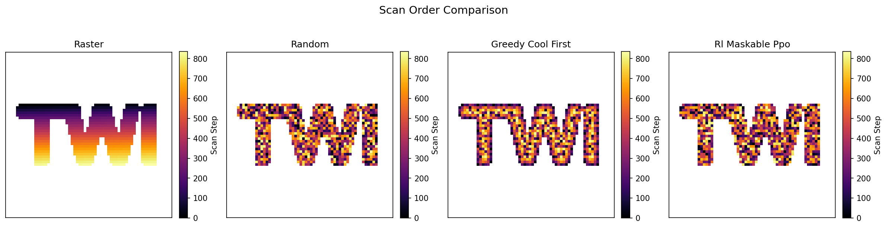
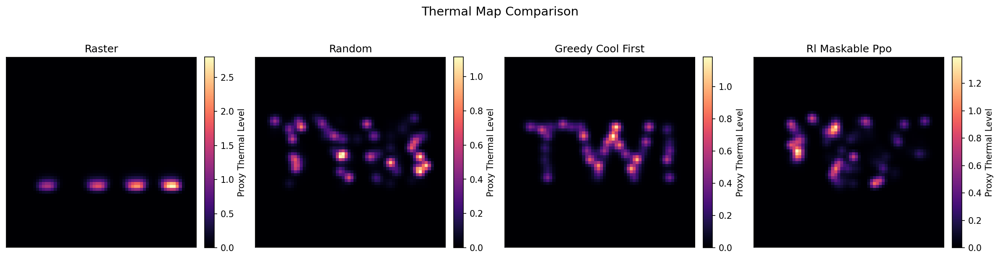
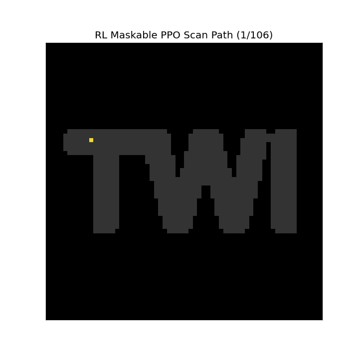
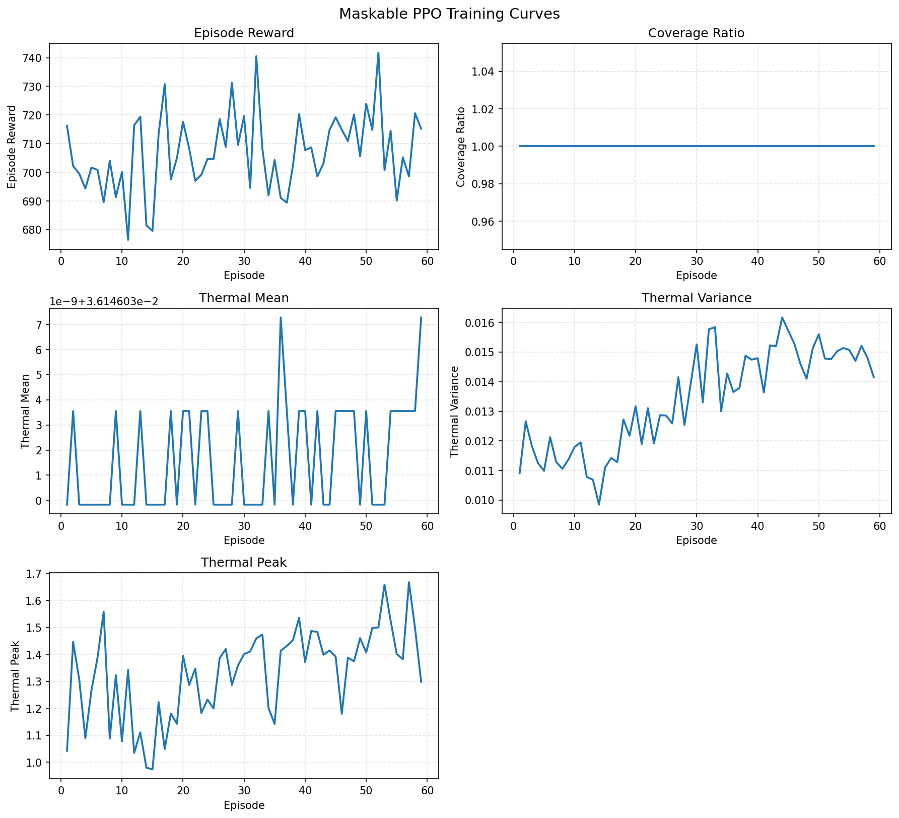

# Training Results

## Model Performance

| Planner | Coverage | Thermal Mean | Thermal Peak | Thermal Variance | Steps |
| --- | ---: | ---: | ---: | ---: | ---: |
| raster | 1.000 | 0.036 | 2.799 | 0.040 | 837 |
| random | 1.000 | 0.036 | 1.115 | 0.012 | 837 |
| greedy_cool_first | 1.000 | 0.036 | 1.183 | 0.012 | 837 |
| rl_maskable_ppo | 1.000 | 0.036 | 1.393 | 0.014 | 837 |

## Graphical Comparison

### Scan Paths

### Thermal Maps

### RL Scan Animation

## Training Curves

## Discussion

The current Maskable PPO model reaches full coverage on the `TWI` letter mask and is compared against raster, random, and greedy cool-first baselines using the same lightweight thermal proxy. The updated reward mixes coverage, global thermal variance penalties, local temperature-difference penalties, hotspot-distribution penalties, and invalid-action penalties while leaving path jumps unconstrained.

Current limitations:
- This is still a proxy thermal environment rather than a calibrated physical model.
- Training uses one fixed geometry and one environment, so generalisation is limited.
- Even with longer training, RL may still trail the strongest handcrafted baselines on this simplified task.

### Training Snapshot

- Episodes recorded: 59
- Final recorded coverage: 1.000
- Final recorded thermal variance: 0.014
- Final recorded thermal peak: 1.298
